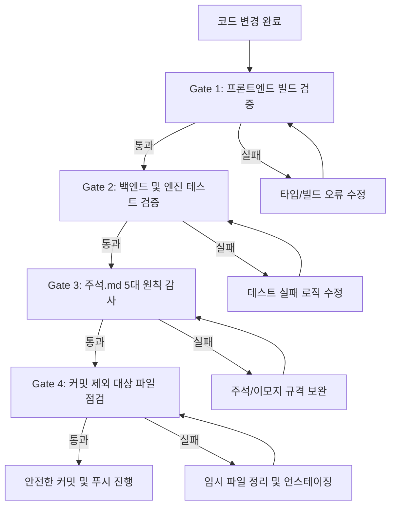

# [공식] 식약처 스튜디오 깃(Git) 커밋 및 푸시 조건 가이드 (깃 커밋 조건.md)

---

## 1. 개요 및 목적

본 문서는 `C:\식약처\work` 저장소에서 변경 사항을 깃(Git)으로 커밋하고 원격 저장소(`origin`)에 푸시할 때 준수해야 하는 **필수 사전 검증 조건, 커밋 메시지 규격, 분할 커밋 전략 및 실행 절차**를 정의한다.

본 가이드의 목적은 다음과 같다:
1. 프론트엔드·백엔드 빌드 및 핵심 테스트의 무결성을 커밋 전에 100% 보장함.
2. `주석.md`에 규정된 공공 표준 주석 규격(5대 원칙)이 유지되도록 강제함.
3. 임시/캐시 파일 및 대용량 산출물이 원격 저장소에 오염되는 것을 방지함.
4. 변경 이력(Git Log)을 기능 및 성격별로 명확히 분리하여 추적성을 극대화함.

---

## 2. 필수 사전 검증 조건 (Pre-Commit / Pre-Push Gates)

커밋을 생성하거나 푸시하기 전, **반드시 아래 4가지 관문(Gate)을 모두 통과**해야 한다.



### Gate 1. 프론트엔드 프로덕션 빌드 검증
TypeScript 타입 검증과 Vite 프로덕션 번들링에 오류가 없어야 한다.
```bash
# 실행 위치: C:\식약처\work
npm run build --workspace=apps/web
```
- **합격 기준**: 빌드 종료 코드 `0`, 타입 오류 `0건`, `✓ built in ...` 정상 출력.

### Gate 2. 백엔드 및 파이프라인 테스트 검증
핵심 변환기, 배치 합성, OCR 엔진 관련 단위 및 회귀 테스트가 모두 통과해야 한다.
```bash
# 실행 위치: C:\식약처\work
.venv\Scripts\pytest.exe apps/api/tests tests/ocr packages/synthetic_engine/tests/document_conversion
```
- **합격 기준**: 실패(`FAILED`) `0건`, 모든 테스트 통과(`passed`).

### Gate 3. `주석.md` 5대 원칙 100% 준수 검증
공공 표준 품질 및 인코딩 깨짐 방지를 위해 `주석.md` 규격을 충족해야 한다.
1. **파일 헤더 박스 의무화**:
   - Python 파일: `# -*- coding: utf-8 -*-` + `# ===...===` 박스 스타일 (`파일명`, `경로`, `목적`, `작성자`, `작성일`, `수정일`).
   - TypeScript/TSX 파일: `/** ... */` JSDoc 블록 스타일.
2. **모든 함수(`def`) 및 메서드 단위 주석**:
   - 함수 선언 상단에 간결한 `# ... ~함` (TS는 `// ... ~함`) 한 줄 주석 필수.
3. **개조식 종결어미 통일**:
   - 모든 설명문 및 주석은 **`~함`**, **`~임`**, **`~음`** 명사형 종결어미 사용 (`~합니다`, `~이다` 서술문 금지).
4. **이모지(Emoji) 전면 금지**:
   - 코드 및 주석 내 일체 금지 (0건).

### Gate 4. 커밋 제외 대상 파일 점검
아래 파일들은 커밋에 포함되지 않도록 `.gitignore`에 등록되어 있거나 스테이징에서 제외되어야 한다.
- **임시 및 스크래치 파일**: `scratch/`, `tmp/`, `.tempmediaStorage/`, `.orchestra/`
- **캐시 및 가상환경**: `.venv/`, `node_modules/`, `__pycache__/`, `.pytest_cache/`, `dist/`
- **실행 산출물**: `output/`, `storage/converted/`, `storage/pseudonymized/` (단, 기본 디렉터리 보존용 `.gitkeep` 제외)
- **대용량 AI/ML 모델 가중치 파일**: `storage/models/*.onnx`, `*.pth`, `*.bin` 등

---

## 3. 커밋 메시지 작성 규칙 (Conventional Commits)

커밋 메시지는 Git 히스토리 분석과 자동 릴리즈 노트를 위해 **Conventional Commits** 형식과 간결한 **한국어 개조식 문체**를 사용한다.

### 3.1 기본 구조
```text
<type>(<scope>): <간결한 한국어 개조식 설명 (~함/추가/수정/개선)>

[선택적 본문: 변경 이유 및 주요 세부 사항]

[선택적 꼬리말: 관련 이슈 번호 등]
```

### 3.2 허용 Type 목록

| Type | 설명 및 적용 기준 |
| :--- | :--- |
| **`feat`** | 새로운 기능 추가 (예: 뷰어 기능, 신규 변환기, 가명화 알고리즘 추가) |
| **`fix`** | 버그 수정 (예: 페이지 이동 불가 결함 수정, 텍스트 깨짐 수정) |
| **`refactor`** | 기능 변화 없이 코드 구조, 가독성, 성능을 개선한 리팩토링 |
| **`docs`** | 문서 또는 주석의 추가·수정 (`주석.md` 준수 주석 반영 등) |
| **`style`** | 코드 로직에 영향을 주지 않는 포맷팅, 세미콜론, 들여쓰기 수정 |
| **`test`** | 테스트 코드 추가, 수정 및 테스트 픽스처 보강 |
| **`chore`** | 빌드 설정, 의존성 패키지 갱신, 유틸리티 스크립트 수정 |

### 3.3 권장 Scope 목록
- `converter`: 문서 및 정형 데이터 변환 기능
- `viewer`: 마크다운 및 원본 대조 뷰어, 스크롤, 페이지네이션
- `ocr`: OCR 파이프라인, 전처리, 신뢰도 평가
- `engine`: `synthetic_engine` 코어 생성기 및 IR 엔진
- `privacy`: 개인정보 가명화 및 비식별화
- `api`: FastAPI 백엔드 라우터 및 서비스
- `web`: React 프론트엔드 UI 컴포넌트 및 상태 관리
- `comments`: 코드 주석 및 파일 헤더 표준화

### 3.4 좋은 예시 vs 나쁜 예시

| 구분 | 커밋 메시지 예시 |
| :--- | :--- |
| **[좋은 예]** | `feat(viewer): 원본-변환본 양방향 대조 뷰어 및 스크롤 동기화 구현` |
| **[좋은 예]** | `fix(converter): 표 셀 분할 왜곡 방지 및 경계선 기하 복원 로직 수정` |
| **[좋은 예]** | `docs(comments): 주석.md 표준화 지침에 따른 전 소스 코드 헤더 및 함수 주석 전수 반영` |
| **[좋은 예]** | `refactor(api): 문서 변환 라우트 예외 처리 구조 개선 및 응답 스키마 정규화` |
| **[나쁜 예]** | `수정함` (변경 내용과 스코프 불명확) |
| **[나쁜 예]** | `feat: 데이터 변환 화면을 예쁘게 고쳤습니다.` (서술형 종결어미 사용 금지) |
| **[나쁜 예]** | `fix: 버그 픽스 완료` (이모지 및 모호한 표현 금지) |

---

## 4. 논리적 분할 커밋 전략 (Commit Splitting)

여러 기능이나 대규모 변경 사항이 발생한 경우, 이를 하나의 거대한 커밋으로 뭉치지 않고 **기능 및 성격에 따라 논리적으로 분할하여 순차 커밋**한다.

현재 저장소의 주요 변경 사항 분할 권장 순서:

### [1단계] 문서 변환 및 뷰어 고도화 (`feat/refactor`)
- **대상 파일**:
  - `apps/web/src/features/converter/*`
  - `apps/api/src/synthetic_api/application/services/document_conversion_service.py`
  - `apps/api/src/synthetic_api/routes/v1/converter.py`
  - `packages/synthetic_engine/synthetic_engine/exporters/ocr_table_reconstructor.py`
- **커밋 메시지 예시**:
  ```bash
  git commit -m "feat(converter): 표 형태 으스러짐 방지 및 원본-변환본 1:1 대조 뷰어·페이지 전환 지원"
  ```

### [2단계] OCR 파이프라인 및 품질 평가 기능 (`feat`)
- **대상 파일**:
  - `packages/ocr/*`
  - `apps/api/src/synthetic_api/application/services/conversion_quality.py`
  - `apps/api/src/synthetic_api/application/services/conversion_rules.py`
- **커밋 메시지 예시**:
  ```bash
  git commit -m "feat(ocr): 분리형 고정밀 OCR 파이프라인 및 변환 품질 신뢰도 평가 엔진 구축"
  ```

### [3단계] 코드베이스 주석 및 헤더 표준화 (`docs`)
- **대상 파일**:
  - `주석.md` 표준 헤더 및 `def` 주석이 반영된 전 소스 코드 파일
  - `주석.md`, `깃 커밋 조건.md`, `저장소작업지침.md`
- **커밋 메시지 예시**:
  ```bash
  git commit -m "docs(comments): 주석.md 5대 원칙에 따른 전체 329개 파일 헤더 및 1,777개 def 함수 주석 전수 반영"
  ```

### [4단계] 테스트 케이스 및 검증 도구 보강 (`test/chore`)
- **대상 파일**:
  - `tests/*`, `packages/synthetic_engine/tests/*`, `benchmarks/*`, `scripts/*`
- **커밋 메시지 예시**:
  ```bash
  git commit -m "test(qa): 문서 변환 충실도 및 OCR 신뢰도 회귀 방지 통합 테스트 슈트 구축"
  ```

---

## 5. 표준 Git 작업 절차 (Step-by-Step Command Guide)

### 1단계: 변경 사항 및 상태 확인
```bash
git status
```
- 스테이징되지 않은 변경 파일과 새로 생성된 파일 목록을 검토함.

### 2단계: 사전 필수 검증 실행 (Gate 1 ~ 3)
```bash
# 1) 프론트엔드 빌드
npm run build --workspace=apps/web

# 2) 백엔드 및 OCR 테스트
.venv\Scripts\pytest.exe apps/api/tests tests/ocr packages/synthetic_engine/tests/document_conversion
```

### 3단계: 임시 파일 및 불필요 파일 정리
```bash
# 임시 스크래치 파일이 스테이징에 들어가지 않았는지 확인
git status -u
```

### 4단계: 변경 단위별 스테이징 및 커밋
```bash
# 파일 그룹별 선별적 스테이징 (예: 변환 및 뷰어 관련)
git add apps/web/src/features/converter/ apps/api/src/synthetic_api/routes/v1/converter.py
git commit -m "feat(converter): 표 형태 으스러짐 방지 및 원본-변환본 1:1 대조 뷰어·페이지 전환 지원"

# 주석 및 문서 관련 스테이징
git add 주석.md "깃 커밋 조건.md" apps/ packages/ tests/ scripts/
git commit -m "docs(comments): 주석.md 5대 원칙에 따른 전체 파일 헤더 및 def 단위 주석 전수 반영"
```

### 5단계: 현재 브랜치 및 커밋 로그 최종 확인
```bash
# 최근 커밋 3건 확인
git log -n 3 --oneline

# 현재 브랜치 확인
git branch --show-current
```

### 6단계: 원격 저장소 푸시
```bash
# 현재 작업 중인 브랜치가 main인 경우
git push origin main

# 특정 작업 브랜치인 경우
git push origin <브랜치명>
```

---

## 6. 비상 복구 및 주의사항 (Safety Guidelines)

1. **`git push --force` 절대 금지**:
   - 공유 브랜치(`main`, `develop` 등)에서 히스토리를 강제로 덮어쓰는 강제 푸시는 협업자의 작업을 파괴하므로 엄격히 금지함.
2. **잘못 스테이징된 파일 해제**:
   - 파일 내용을 유지하면서 스테이징만 취소할 때:
     ```bash
     git restore --staged <파일경로>
     ```
3. **가장 최근 커밋 메시지만 수정**:
   - 푸시하기 전, 최근 커밋 메시지의 오타를 수정할 때:
     ```bash
     git commit --amend -m "올바른 커밋 메시지"
     ```
4. **대용량 파일 커밋 차단**:
   - 100MB를 초과하는 파일은 GitHub 푸시 시 차단되므로 반드시 `.gitignore`에 등록되어 있는지 확인함.
